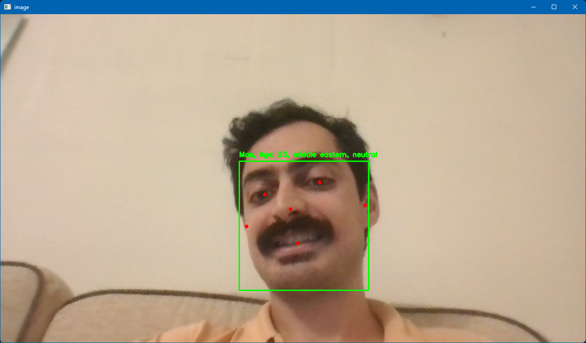
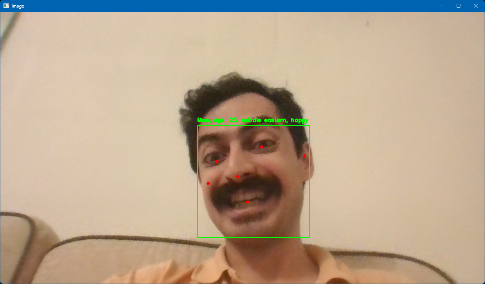

# Emotion Detection and Analysis Project

## 🌟 Overview

This project is a **real-time emotion detection and analysis system** powered by computer vision and deep learning. It uses **OpenCV**, **Mediapipe**, and **DeepFace** to detect faces and analyze emotional expressions, age, gender, and race from live video streams. Whether you're working on a fun AI project or developing advanced emotion recognition tools, this project provides a solid foundation.

---

## 🚀 Features

- **Real-Time Emotion Analysis**:
  Detects and identifies emotions such as happiness, sadness, anger, surprise, and more.
  
- **Age, Gender, and Race Detection**:
  Provides additional insights into the detected face, including approximate age, gender, and race.

- **Beautiful Visuals**:
  Draws bounding boxes and key points on detected faces in the video feed.

- **Extensive Pretrained Models**:
  Utilizes **DeepFace**'s state-of-the-art pretrained models for robust emotion detection.

---

## 🛠️ Tech Stack

- **Python 3.7+**
- **OpenCV**: For real-time video processing.
- **Mediapipe**: For high-performance face detection.
- **DeepFace**: For advanced emotion, age, gender, and race analysis.
- **TensorFlow/Keras**: Backend for DeepFace.

---

## 🖥️ How It Works

1. Captures video from the camera using OpenCV.
2. Detects faces in real-time with Mediapipe's face detection model.
3. Extracts facial regions and passes them to DeepFace for analysis.
4. Displays real-time results, including:
   - Emotion
   - Age
   - Gender
   - Race
   - 
---

## 📦 Installation

1. Clone the repository:
   ```bash
   git clone https://github.com/pooyanasiri/emotion-detection.git
   cd emotion-detection
   ```

2. Install dependencies:
   ```bash
   pip install opencv-python mediapipe deepface
   ```

3. Run the script:
   ```bash
   python face_detection.py
   ```

---

## 🎥 Demo

Here’s how it looks in action:

- Real-time face detection with bounding boxes.
- Emotion, age, gender, and race displayed on-screen in real-time.




---

## 📋 Code Explanation

### **1. Emotion Detection**

```python
def detect_emotion(face_image):
    rgb_face = cv2.cvtColor(face_image, cv2.COLOR_BGR2RGB)
    analysis = DeepFace.analyze(
        rgb_face, actions=['emotion', 'age', 'gender', 'race'], enforce_detection=False
    )
    emotion = analysis[0]['dominant_emotion']
    gender = analysis[0]['dominant_gender']
    age = analysis[0]['age']
    race = analysis[0]['dominant_race']
    return f"{gender}, Age: {age}, {race}, {emotion}"
```

This function analyzes a cropped face image and returns a string with detected attributes.

---

### **2. Face Detection and Video Streaming**

```python
def extract_faces_and_detect_emotions():
    cap = cv2.VideoCapture(0)
    cap.set(cv2.CAP_PROP_FRAME_WIDTH, 1920)
    cap.set(cv2.CAP_PROP_FRAME_HEIGHT, 1080)
    cap.set(cv2.CAP_PROP_FPS, 5)

    with mp_face_detection.FaceDetection(min_detection_confidence=0.5) as face_detection:
        while cap.isOpened():
            ret, frame = cap.read()
            if not ret:
                break
            rgb_frame = cv2.cvtColor(frame, cv2.COLOR_BGR2RGB)
            results = face_detection.process(rgb_frame)
            # Additional face detection and emotion analysis logic...
```

This captures the video feed, detects faces, and runs emotion detection for each detected face.

---

## ⚙️ Configuration

- **Camera Settings**:
  Modify `cv2.VideoCapture(0)` for other video sources.
  
- **Performance Optimization**:
  - Adjust `cap.set(cv2.CAP_PROP_FRAME_WIDTH, 1280)` for lower resolution.
  - Reduce FPS to improve latency.

---

## 🔧 Troubleshooting

1. **Dependencies Issue**:
   Ensure all required libraries are installed:
   ```bash
   pip install -r requirements.txt
   ```

2. **Camera Not Working**:
   Check camera permissions and availability:
   ```bash
   python -m pip uninstall opencv-python
   pip install opencv-python-headless
   ```

3. **DeepFace Model Errors**:
   Clear the cache if models fail to load:
   ```python
   import shutil
   shutil.rmtree('/root/.deepface', ignore_errors=True)
   ```

---

## ✨ Future Enhancements

- **Add Multi-Face Support**: Simultaneously analyze emotions for multiple faces.
- **Deploy to Mobile Devices**: Convert the application into an Android APK or web app.
- **Enhance Performance**: Integrate GPU acceleration with TensorFlow for faster processing.
- **Custom Model Integration**: Train a custom model for specific use cases.

---

## 🧑‍💻 Author

- **Pooya Nasiri**: Developer and AI enthusiast.
- Feel free to reach out on [GitHub](https://github.com/PooyaNasiri) or [LinkedIn](https://linkedin.com/in/PooyaNasiri).


Enjoy building your real-time emotion detection system! 🎉
